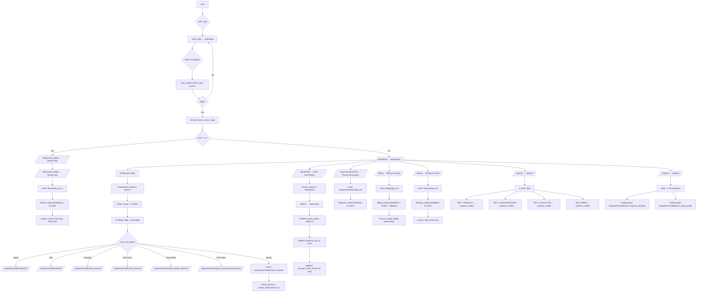

# PHASE UI-15 — FINAL USER FLOW AUDIT REPORT

**Tanggal:** 2026-09-28  
**Scope:** Audit end-to-end alur pengguna SIMPELDAR CI3 (login → laporan)  
**Mode:** READ-ONLY — tidak ada kode diubah

---

## 1. USER JOURNEY MAP

### A. LOGIN (PUBLIC)
```
User → GET /auth → Auth::index → auth/login (view)
     → POST /auth/login → Auth::login → User_model::check_login(usrmst)
     → valid: session[level, uname, login] set
     → level 2 → redirect /darah/view_dokter (Rawat Inap)
     → else → redirect /dashboard
```
- **Role**: All (public)
- **Tables**: `darah.usrmst` (USRID, USRNM, PASSWORD plaintext, LEVEL)
- **View**: `auth/login.php` (legacy login_style assets)
- **Security**: CSRF token via meta + `/auth/csrf` endpoint

### B. DASHBOARD (LEVEL 1)
```
GET /dashboard → Dashboard::index → Dashboard_model (11 methods)
    → pesan_darah + 8 JOINs (referensi×3, ruangan, kelengkapan, status_terima, jenis_darah, variabel)
    → 10 tabs status (permintaan, sedang_proses, siap, donor, baru, incompatible, masasimpan, belumambil, habis, tidaklengkap)
    → Single DataTable re-render via JS per tab
    → Stat cards clickable → switch tab
```
- **Role**: Level 1 only (Admin)
- **Controller**: `Dashboard.php` — `index()`
- **Model**: `Dashboard_model` — 11 `get_*` methods
- **View**: `dashboard/index.php` (543 lines, inline JS)
- **Tables**: `pesan_darah` + 8 JOINs
- **Status transaksi**: Filter by `pesan_darah.status` (0-9 per referensi JENIS=3)
- **Actions per row**: Detail (dead link), Cetak Bon (dead link), Edit (dead link)

### C. FORM PERMINTAAN DARAH (LEVEL 1)
```
GET /darah/form → Darah::form → Darah_model (14 dropdowns)
    → Dropdown: referensi (JENIS=1,2,3,5), jenis_darah, dokter, ruangan, analis, perawat, variabel
    → autofill_pasien (AJAX) → pasien2 MR lookup
    → lookup_kantong (AJAX) → kantong_luar nomor lookup
POST /darah/submit → Darah::submit (transaction)
    → INSERT pesan_darah (80+ cols)
    → INSERT kantong_luar (12 rows)
    → INSERT petugas_serah_terima (12 rows)
    → COMMIT/ROLLBACK
```
- **Role**: Level 1
- **Controller**: `Darah.php` — `form()`, `autofill_pasien()`, `lookup_kantong()`, `submit()`
- **Model**: `Darah_model` — 14 dropdown + 3 insert methods
- **View**: `darah/form.php` → components (patient_card, request_card, examination_card, blood_component_card, action_button)
- **Tables**: `pesan_darah`, `kantong_luar`, `petugas_serah_terima` + master tables
- **Status transaksi**: `pesan_darah.status = 0` (Permintaan) on insert
- **Bugs**: `nm_creat` uses `$_SESSION['uname']` (string) instead of `$_SESSION['login']` (int) — fails strict mode

### D. PROSES PERMINTAAN / REQUEST LIST (LEVEL 1)
```
GET /requestcontroller/list → RequestController::list → request/list.php
    → AJAX /requestcontroller/ajax_list → Request_model::get_datatables (8 JOINs)
Actions per row (7 buttons):
    → View Detail → /requestcontroller/detail/:id
    → Edit → /requestcontroller/edit/:id
    → Print Bon → /requestcontroller/print_bon/:id (new tab)
    → Print Form → /requestcontroller/print_form/:id (new tab)
    → Print Detail Darah → /requestcontroller/print_detail_darah/:id (new tab)
    → Print Hasil → /requestcontroller/print_hasil_pemeriksaan/:id (new tab)
    → Terima Sampel → POST /requestcontroller/mark_received → status_terima=1 + pesan_darah.status=10
```
- **Role**: Level 1
- **Controller**: `RequestController.php` — 12 methods
- **Model**: `Request_model` — datatables, detail, print, edit, update, mark_received
- **View**: `request/list.php` + `components/list_table.php` + `request-list.js`
- **Tables**: `pesan_darah` + 8 JOINs (referensi×3, ruangan, kelengkapan, status_terima, jenis_darah, variabel)
- **Status transaksi**: `status` 0→5→10; `status_terima` 0/1; `kelengkapan` 0/1

### E. RAWAT INAP (LEVEL 1 + 2)
```
GET /darah/view_dokter → Darah::view_dokter → darah/rawat_inap.php
    → Filter: ruangan, status, tgl_awal/akhir, no_permintaan, MR, nama
    → AJAX /darah/ajax_list_ri → Darah_model::get_datatables_ri (8 JOINs, 1 month default)
Actions per row:
    → Detail → /requestcontroller/detail/:id
    → Cetak Bon → /requestcontroller/print_bon/:id (new tab)
    → Cetak Hasil → /requestcontroller/print_hasil_pemeriksaan/:id (new tab)
```
- **Role**: Level 1 + 2 (Petugas Rawat Inap)
- **Controller**: `Darah.php` — `view_dokter()`, `ajax_list_ri()`
- **Model**: `Darah_model` — `get_datatables_ri`, `count_filtered_ri`, `count_all_ri`
- **View**: `darah/rawat_inap.php` + `rawat-inap.js`
- **Tables**: `pesan_darah` + 8 JOINs (filter ruangan.JENIS=5)
- **Missing auth**: `require_level()` was added in UI-13 (level 1,2)

### F. BILLING KANTONG (LEVEL 1)
```
GET /billing → Billing::index → billing/index.php
    → Filter: ruangan, status billing, tgl_awal/akhir, no_permintaan, MR
    → AJAX /billing/ajax_list → Billing_model::get_datatables (2 JOINs + correlated subquery)
Actions per row:
    → View Detail → /requestcontroller/detail/:id
    → Proses Billing → button exists (tblBilling) but handler only shows toast "belum tersedia"
```
- **Role**: Level 1
- **Controller**: `Billing.php` — `index()`, `ajax_list()`
- **Model**: `Billing_model` — `get_datatables`, `get_ruangan`, `get_status_billing`
- **View**: `billing/index.php` + `components/filter_card.php`, `components/billing_table.php` + `billing.js`
- **Tables**: `pesan_darah`, `ruangan`, `jenis_darah`, `cek_billing`
- **Status transaksi**: `cek_billing.status` 0/1 (Belum/Sudah Billing)

### G. RIWAYAT PASIEN (LEVEL 1)
```
GET /riwayat → Riwayat::index → riwayat/index.php
    → Filter: tgl_awal/akhir, MR, nama
    → AJAX /riwayat/ajax_list → Riwayat_model::get_datatables (5 JOINs)
Actions per row:
    → Edit → /requestcontroller/edit/:id
    → Cetak Form → /requestcontroller/print_form/:id (new tab)
```
- **Role**: Level 1
- **Controller**: `Riwayat.php` — `index()`, `ajax_list()`
- **Model**: `Riwayat_model` — `get_datatables`, `count_all`, `count_filtered`
- **View**: `riwayat/index.php` + `components/filter_card.php`, `components/history_table.php` + `riwayat.js`
- **Tables**: `pesan_darah`, `ruangan`, `variabel`, `referensi`, `jenis_darah`

### H. LAPORAN (LEVEL 1)
```
GET /laporan → Laporan::index → laporan/index.php (4 tabs via BS5 tabs)
Tab 1: Pelayanan → AJAX /laporan/ajax_pelayanan → Laporan_model::get_laporan_pelayanan
Tab 2: Jumlah Permintaan → AJAX /laporan/ajax_jumlah_permintaan → Laporan_model::get_jumlah_permintaan (group by status)
Tab 3: Jumlah Jenis → AJAX /laporan/ajax_jumlah_jenis → Laporan_model::get_jumlah_jenis (group by jenis_darah)
Tab 4: Billing Kantong → AJAX /laporan/ajax_billing → Laporan_model::get_billing_kantong
```
- **Role**: Level 1
- **Controller**: `Laporan.php` — `index()` + 4 AJAX methods
- **Model**: `Laporan_model` — 4 query pairs (get + count)
- **View**: `laporan/index.php` + components (filter_card, pelayanan_table, permintaan_table, jenis_table, billing_table) + `laporan.js`
- **Tables**: `pesan_darah`, `analis`, `ruangan`, `referensi` (JENIS=3), `jenis_darah`, `cek_billing`
- **Deep-link**: `?tab=statistik` removed in UI-14C (was duplicate of Laporan Pelayanan)

### I. CETAKAN (LEVEL 1)
```
GET /cetakan → Cetakan::index → cetakan/index.php
    → Filter: tgl_awal/akhir, analis, data_entry, dokter_konsul, statusp
    → 2 print buttons (JS):
        → Cetak Laporan Lengkap → window.open /RequestController/print_laporan_lengkap?params
        → Cetak Rekap Analis → window.open /RequestController/print_rekap_analis?params
```
- **Role**: Level 1
- **Controller**: `Cetakan.php` — `index()` only
- **Model**: `Darah_model` (dropdowns only)
- **View**: `cetakan/index.php` + `components/filter_card.php`, `components/export_card.php` + `cetakan.js`
- **Tables**: `analis`, `usrmst`, `dokter`, `referensi` (dropdowns only)
- **Note**: Print endpoints are in `RequestController`, not `Cetakan`

---

## 2. TOMBOL / LINK / ENDPOINT AUDIT

### 2.1 DEAD LINKS (404 CONFIRMED)
| Location | Link/Button | Target URL | Status | Fix Target |
|----------|-------------|------------|--------|------------|
| `dashboard/index.php:32-34` (hardcoded) | Detail (eye icon) | `/cetakan/bonminta?id=` | **404** | `/requestcontroller/print_bon/:id` |
| `dashboard/index.php:32-34` (hardcoded) | Detail (eye icon) | `/darah/detail_view?id=` | **404** | `/requestcontroller/detail/:id` |
| `dashboard/index.php:32-34` (hardcoded) | Edit | `/darah/edit_permintaan?id=` | **404** | `/requestcontroller/edit/:id` |
| `dashboard/scripts.php:28` (orphaned view) | Detail | `/darah/detail_view?id=` | **404** | same |
| `dashboard/scripts.php:51` (orphaned view) | Edit | `/darah/edit_permintaan?id=` | **404** | same |

> **Note**: Dashboard uses query param `?id=`, but RequestController expects URI segment `/:id`.

### 2.2 BUTTONS WITH NO BACKEND ACTION
| Location | Button | Handler | Status |
|----------|--------|---------|--------|
| `billing/components/billing_table.php` + `billing.js:131-136` | "Proses Billing" (tblBilling) | Toast "belum tersedia" | **Incomplete** — no endpoint |
| `layouts/navbar.php:25,42,63,66` | Notifikasi bell, User dropdown items | `href="#"` | **Placeholder** — no dropdown menu content |
| `layouts/main.php` (orphaned) | All nav links | Various | **Orphaned view** — not loaded by any controller |

### 2.3 UNUSED CONTROLLER METHODS
| Controller | Method | Route | Reason |
|------------|--------|-------|--------|
| `Welcome.php` | `index()` | `/` | Route `default_controller=auth` overrides |
| `Cetakan.php` | (none) | — | Only `index()` exists; no `bonminta` etc. |

### 2.4 UNUSED ENDPOINTS (ROUTEABLE BUT NOT LINKED)
| Endpoint | Controller/Method | Called By |
|----------|-------------------|-----------|
| `/auth/csrf` | `Auth::csrf()` | `app.js` AJAX token refresh (active) |
| `/requestcontroller/print_laporan_lengkap` | `RequestController::print_laporan_lengkap()` | `cetakan.js` btnPrintLaporanLengkap (active) |
| `/requestcontroller/print_rekap_analis` | `RequestController::print_rekap_analis()` | `cetakan.js` btnPrintRekapAnalis (active) |
| `/darah/autofill_pasien` | `Darah::autofill_pasien()` | `form-darah.js`, `request-edit.js` (active) |
| `/darah/lookup_kantong` | `Darah::lookup_kantong()` | `form-darah.js`, `request-edit.js` (active) |

### 2.5 FITUR NATIVE YANG BELUM TERMIGRASI (DARI AUDIT LAMA)
| Fitur Native | Status CI3 | Catatan |
|--------------|------------|---------|
| JavaBridge + JasperReports (Bon, Form, Hasil, Detail, Laporan) | ❌ Tidak dipindah | Diganti HTML view + `window.print()` — **Functional parity OK** |
| Remote SIMRS tables (`layanan.*`, `pendaftaran.*`, `master.*`) | ❌ Tidak ada di local | CI3 pakai `pesan_darah` + `cek_billing` + `kantong_luar` lokal — **Adaptasi sengaja** |
| Table `darah.pasien` (NORM, GOLONGAN_DARAH) | ❌ Missing | `Darah_model::update_pasien_goldar()` dead code, commented in submit |

---

## 3. DATABASE AUDIT

### 3.1 TABEL DARAH YANG DIGUNAKAN (17/22)
| Table | Purpose | Used By | Rows |
|-------|---------|---------|------|
| `pesan_darah` | Core requests | All modules | 175K+ |
| `cek_billing` | Billing per bag | Billing, Laporan, Request | ? |
| `kantong_luar` | External bags | Darah, Request, Dashboard | ? |
| `kelengkapan` | Completeness | Dashboard, Request | ? |
| `pasien2` | Local patients | Darah, Request | ? |
| `usrmst` | Users | Auth, Dropdowns, Reports | ~87 |
| `ruangan` | Rooms | All modules | ? |
| `referensi` | Lookups (9 JENIS) | All modules | ? |
| `variabel` | Variables | Dropdowns, Reports | ? |
| `jenis_darah` | Blood types | All modules | ? |
| `dokter` | Doctors | Darah, Request, Laporan | ? |
| `perawat` | Nurses | Darah, Request | ? |
| `analis` | Analysts | Darah, Laporan, Request | ? |
| `status_terima` | Receipt status | Request, Dashboard | ? |
| `pegawai` | Staff (join dokter) | Reports (JOIN only) | ? |
| `petugas_serah_terima` | Handover staff | Darah, Request | ? |
| `numbset` | Numbering | **UNUSED** | ? |

### 3.2 TABEL TIDAK DIGUNAKAN (5/22)
| Table | Status | Rekomendasi |
|-------|--------|-------------|
| `numbset` | Tidak direferensi model manapun | Archive / drop |
| `dsphis` | Legacy/unknown | Archive / drop |
| `perawat_terima` | Tidak direferensi | Archive / drop |
| `petugas_serah_terima_copy1` | Backup table | Archive / drop |
| `ruangan_copy1` | Backup table | Archive / drop |

### 3.3 TABEL PENTING TANPA UI LANGSUNG
| Table | Digunakan Di | UI Akses |
|-------|--------------|----------|
| `status_terima` | Request (mark_received), Dashboard (badge) | Via Request List "Terima" button |
| `kelengkapan` | Dashboard (badge), Request (edit checkbox) | Via Request Edit "Sudah Lengkap" |
| `petugas_serah_terima` | Darah submit, Request edit | Auto-filled on create/edit |
| `kantong_luar` | Darah submit, Request edit, Detail print | Auto-filled + override on edit |
| `pegawai` | JOIN di Request_model, Darah_model (dokter) | Read-only via dropdown dokter |

---

## 4. APLIKASI FLOW DIAGRAM (MERMAID)



---

## 5. MODUL DEPENDENCY MAP

```
┌─────────────────────────────────────────────────────────────────────────────┐
│                           SIMPELDAR CI3 DEPENDENCY MAP                      │
├─────────────────────────────────────────────────────────────────────────────┤
│                                                                             │
│  ┌──────────┐         ┌──────────────────┐                                 │
│  │  Auth    │────────▶│  MY_Controller   │◀── Session/Auth check           │
│  │ (public) │         │  (base auth)     │                                 │
│  └──────────┘         └────────┬─────────┘                                 │
│                                │                                          │
│         ┌──────────────────────┼──────────────────────┐                   │
│         ▼                      ▼                      ▼                   │
│  ┌──────────┐           ┌────────────┐         ┌────────────┐            │
│  │ Dashboard│           │   Darah    │         │Admin_Controller│         │
│  │(level 1) │           │(level 1,2) │         │  (level 1)  │            │
│  └────┬─────┘           └─────┬──────┘         └──────┬──────┘            │
│       │                       │                     │                      │
│       ▼                       ▼                     ▼                      │
│  Dashboard_model        Darah_model              ┌────────┐               │
│  (11 queries)           (14 dropdowns + 3 inserts)│Laporan │               │
│                         (pasien2, kantong_luar)  │  ├─────┤               │
│                         (petugas_serah_terima)   │  │4 AJAX│               │
│                                                  │  │tabs  │               │
│                                                  └────┬───┘               │
│                                                       │                   │
│  ┌────────────┐    ┌────────────┐    ┌────────────┐   │                   │
│  │RequestCtrl │    │  Billing   │    │  Riwayat   │   │                   │
│  │(level 1)   │    │(level 1)   │    │(level 1)   │   │                   │
│  └─────┬──────┘    └─────┬──────┘    └─────┬──────┘   │                   │
│        │                 │                 │            │                   │
│        ▼                 ▼                 ▼            ▼                   │
│  Request_model      Billing_model      Riwayat_model  Laporan_model       │
│  (12 methods)       (3 methods)        (3 methods)   (4×2 methods)        │
│                                                                             │
│  ┌─────────────────────────────────────────────────────────────────────┐  │
│  │                    SHARED DATABASE TABLES                            │  │
│  │  pesan_darah ◀──┬── cek_billing ──┬── kantong_luar ──┬── kelengkapan │  │
│  │                 │                 │                │                │  │
│  │           status_terima      petugas_serah_terima  │                │  │
│  │                 │                 │                │                │  │
│  │        ┌────────┴────────┐       │                │                │  │
│  │        ▼                 ▼       ▼                ▼                │  │
│  │  referensi (9 JENIS)  variabel  jenis_darah    ruangan            │  │
│  │        │                 │       │                │                │  │
│  │        └─────────────────┴───────┴────────────────┘                │  │
│  │                         │                                         │  │
│  │                    ┌────┴────┐                                   │  │
│  │                    ▼         ▼                                   │  │
│  │                dokter      analis      perawat                   │  │
│  │                    │         │         │                          │  │
│  │                    └────┬───┴────┬────┘                          │  │
│  │                         ▼         ▼                               │  │
│  │                    pasien2 (local)                                │  │
│  │                                                                   │  │
│  │  UNUSED: numbset, dsphis, perawat_terima, *_copy1                │  │
│  └─────────────────────────────────────────────────────────────────────┘  │
│                                                                             │
└─────────────────────────────────────────────────────────────────────────────┘
```

---

## 6. STATUS TRANSAKSI FLOW (pesan_darah.status)

```
Referensi JENIS=3:
0  → Permintaan (initial on submit)
1  → Sedang Proses
2  → Darah Siap
3  → Perlu Donor
4  → Sampel Baru
5  → Incompatible
6  → Masa Simpan Habis
7  → Belum Diambil
8  → Sudah Habis
9  → (unused?)
10 → Sudah Terima Sampel Darah (set via mark_received)

Transitions:
0 ──(auto-process)──▶ 1 ──(prep)──▶ 2 ──(mark_received)──▶ 10
     │                    │
     ├─(donor needed)──▶ 3
     ├─(new sample)────▶ 4
     ├─(incompatible)──▶ 5
     ├─(expired)───────▶ 6
     └─(not picked)────▶ 7 ──(auto)──▶ 8
```

---

## 7. REKOMENDASI FINAL

### P0 — Critical (Bloker Produksi / Keamanan)
| # | Item | File/Location | Effort | Alasan |
|---|------|---------------|--------|--------|
| 1 | Fix `nm_creat` type mismatch | `Darah.php:197` | 1 line | `$_SESSION['uname']` (string) → `$_SESSION['login']` (int); fails MySQL strict mode |
| 2 | Fix Dashboard 3 dead links | `dashboard/index.php:32-34` | 3 lines | `cetakan/bonminta`, `darah/detail_view`, `darah/edit_permintaan` → RequestController endpoints |
| 3 | Plaintext passwords | `usrmst.PASSWORD`, `User_model::check_login` | 1-2 hrs | `password_hash`/`password_verify` migration required |
| 4 | ORDER BY injection | `Request_model.php:124` | 1 line | Clamp `$dir` to ASC/DESC (fixed in other models, missed here) |

### P1 — High (Fungsionalitas Tidak Lengkap)
| # | Item | File/Location | Effort | Alasan |
|---|------|---------------|--------|--------|
| 5 | Billing "Proses Billing" button | `billing.js:131-136` | 2-4 hrs | Hanya toast — butuh endpoint `billing/process` + model upsert `cek_billing` |
| 6 | Navbar dropdown empty items | `layouts/navbar.php:63,66` | 10 min | Isi dengan link Profil/Password/Logout atau hapus |
| 7 | Move transactions to models | `Darah::submit()`, `RequestController::update()`, `mark_received()` | 30 min | Layer separation; controller only orchestrates |

### P2 — Medium (Dead Code / Cleanup)
| # | Item | Files | Effort |
|---|------|-------|--------|
| 8 | Hapus `Welcome.php` | `controllers/Welcome.php` | 1 min |
| 9 | Hapus orphaned views | `layouts/main.php`, `layouts/navbar.php`, `layouts/footer.php`, `dashboard/scripts.php`, `dashboard/style.php`, `welcome_message.php`, `errors/error_403.php` (dup), `errors/cli/*` | 10 min |
| 10 | Hapus legacy asset dirs | `assets/admin/`, `assets/fonts/`, `assets/sweetalert/`, `assets/datepicker/`, `assets/datetimepicker/`, `assets/img/` | 5 min (~24 MB) |
| 11 | Hapus unused CSS/JS | 29 CSS + 20 JS files (see Full Audit G) | 10 min |
| 12 | Drop unused tables | `numbset`, `dsphis`, `perawat_terima`, `petugas_serah_terima_copy1`, `ruangan_copy1` | 5 min (SQL) |

### P3 — Low (Security Hardening)
| # | Item | Effort |
|---|------|--------|
| 13 | Password reset flow | 4 hrs |
| 14 | Audit logging untuk write ops | 2 hrs |
| 15 | HTTPS + cookie_secure + dedicated DB user | Config only |

### P4 — Long-term (Arsitektur)
| # | Item | Effort |
|---|------|--------|
| 16 | Konsolidasi Dashboard 11 queries → 1-2 | 30 min |
| 17 | Migrasi login page ke layout utama (hapus login_style) | 2 hrs |
| 18 | CI3 → CI4 migration path planning | Weeks |

---

## 8. KESIMPULAN

| Area | Status | Catatan |
|------|--------|---------|
| **Auth & Session** | ✅ Operational | Plaintext password = risiko keamanan |
| **Dashboard** | ⚠️ Partial | 3 dead links di row actions; stat cards & tabs OK |
| **Form Darah** | ⚠️ Partial | Bug `nm_creat` (P0); dropdown & submit OK |
| **Request List** | ✅ Full | 7 actions/row semua jalan |
| **Rawat Inap** | ✅ Full | Level 1+2; auth fixed UI-13 |
| **Billing** | ⚠️ Partial | List OK; "Proses Billing" placeholder |
| **Riwayat** | ✅ Full | Filter MR + print form |
| **Laporan** | ✅ Full | 4 tabs AJAX semua 200 |
| **Cetakan** | ✅ Full | 2 print buttons → RequestController |
| **Database** | 93% compat | 17/22 tabel dipakai; 5 unused; `pesan_darah` central |
| **Security** | ⚠️ Gaps | CSRF OK, XSS OK, SQLi OK, ORDER BY clamp needed, plaintext pwd |
| **Dead Code** | ~24 MB + 14 views | Documented untuk cleanup |

**Overall Readiness**: **Functionally complete untuk local/private deployment**.  
**Production Blocker**: Password plaintext + `nm_creat` bug + 3 dead links di Dashboard.

---

**PHASE UI-15 — AUDIT SELESAI. Tidak ada file diubah.**